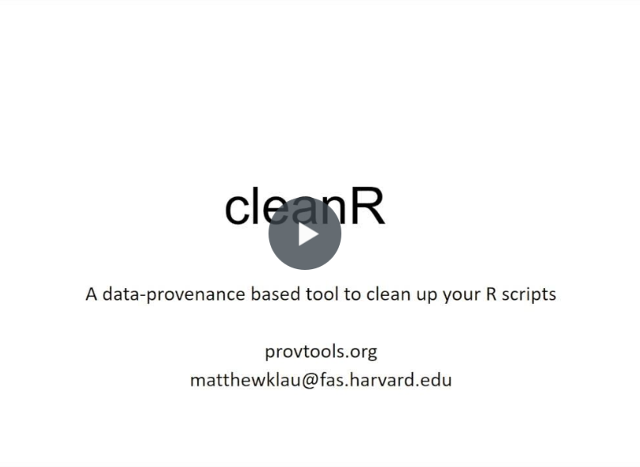

[](https://travis-ci.org/ProvTools/cleanR)

[](https://travis-ci.org/ProvTools/cleanR)

Clean up your code
==================

- Have you ever written a long script in R that conducts oodles of
  analyses and wished that someone would come along and make it all
  clearer to understand and use?
- Well you’re not alone. 
- A recent survey of over 1500 scientists reported a crisis of reproducibility with "selective reporting" being 
  the most cited contributing factor and 80% saying code availability is playing a role
- We created **cleanR** to help scientists more *easily* write "cleaner" code
- [cleanR](https://github.com/ProvTools/cleanR) provides a simple way get the code you need to produce a specific result
- **cleanR** uses data provenance tp capture what your code actually
  does when it’s running and then allows you to pull out the essential
  code that produces specific outputs.
- By focusing in on the specific results you want, **cleanR** let’s
  you spend more energy on your science and less time figuring out
  your code.

<!-- [](cleanR_demo_small.mp4) -->

Install and Setup
=================

Install the latest version easily with [devtools](https://github.com/hadley/devtools):

```R
library(devtools)
install_github("ProvTools/cleanR")
install_github("ProvTools/provR")
install.packages("jsonlite”)
install.packages("igraph”)
install.packages("formatR”)
```

Then prior to use, load-up the following packages:

```R
library(cleanR)
library(provR)
library("jsonlite")
library(igraph)
library(formatR)
```

Usage
=====

Once you have your script and workspace setup, you can use
[cleanR](https://github.com/ProvTools/cleanR) to get clean chunks of a
larger script that produce specific results you want. 

```R
cleanR(file = "messycode.R")

```

This will load the necessary information that cleanR uses to parse
your script. It will return a set of results that you can choose
from. Pick the one you want and check out the code.


```R
cleanR(result = "save1.csv")
```

In many cases, it's handy just to take a look at the isolated code,
but if you can also save the code for later use or sharing.

```R
my.code <- clean
write.code(my.code, file = "save1_csv.R")

```


