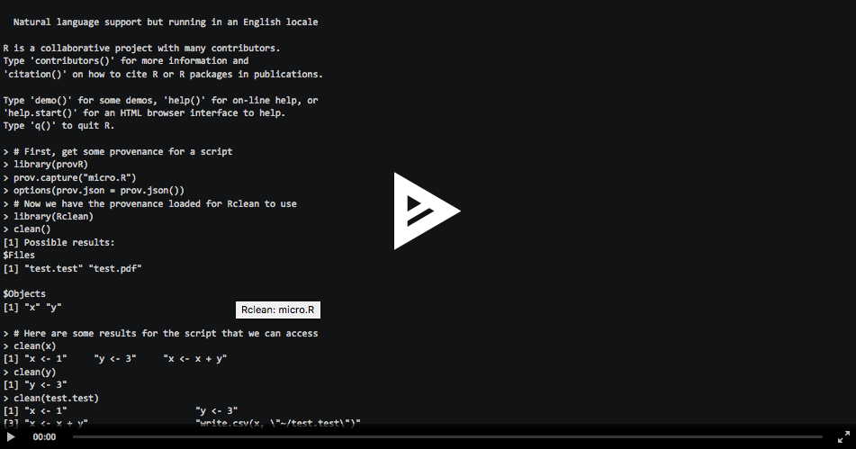

<!-- README.md is generated from README.Rmd. Please edit that file -->
<!-- # ijtiff   -->
<!-- Code status -->
[](https://travis-ci.org/ProvTools/Rclean) [](https://travis-ci.org/ProvTools/Rclean) [](https://zenodo.org/badge/latestdoi/102645585)

<!-- R status -->
[](https://cran.r-project.org/package=Rclean)   [](http://www.rdocumentation.org/packages/Rclean)

<!-- Dev status -->
[](http://www.repostatus.org/#active) [](https://www.tidyverse.org/lifecycle/#maturing)

<!-- Package Review -->
[](https://github.com/ropensci/onboarding/issues/164) [](http://joss.theoj.org/papers/334d80d5508056dc6e7e17c6fd3ed5a6)

Clean up your code
==================

-   Have you ever written a long script in R that conducts oodles of analyses and wished that someone would come along and make it all clearer to understand and use?
-   Well you’re not alone.
-   A recent survey of over 1500 scientists reported a crisis of reproducibility with "selective reporting" being the most cited contributing factor and 80% saying code availability is playing a role
-   We created **Rclean** to help scientists more *easily* write "cleaner" code
-   [Rclean](https://github.com/ProvTools/Rclean) provides a simple way get the code you need to produce a specific result
-   **Rclean** uses data provenance tp capture what your code actually does when it’s running and then allows you to pull out the essential code that produces specific outputs.
-   By focusing in on the specific results you want, **Rclean** let’s you spend more energy on your science and less time figuring out your code.

Install and Setup
=================

You can install [Rclean](https://cran.r-project.org/web/packages/Rclean/) from *CRAN*:

``` r
install.packages("Rclean")
```

You can install the most up to date version easily with [devtools](https://github.com/hadley/devtools):

``` r
install.packages("devtools")
devtools::install_github("ProvTools/cleanR")
```

You will also need to be able to generate data provenance from your script. This can be done using [provR](https://github.com/ProvTools/):

``` r
devtools::install_github("ProvTools/provR")
```

Once installed, per usual R practice, just load the *Rclean* and *provR* packages:

``` r
library(Rclean)
library(provR)
```

Usage
=====

Here's a [demo video](https://asciinema.org/a/osSGbvH3GKA3r3QMJ2Tlba1pu) for the following example:

[](https://asciinema.org/a/osSGbvH3GKA3r3QMJ2Tlba1pu)

Once you have your script and workspace setup, you can use [Rclean](https://github.com/ProvTools/Rclean) to get clean chunks of a larger script that produce specific results you want. We'll use the micro.R script, which can be found inside the package repo in the *exec* directory. The following example assumes that your current working directory is *exec*.

First, you'll need to record information about the script you would like to parse. [Rclean](https://github.com/ProvTools/Rclean) uses data provenance to verify what lines of code depend on each other inside of the larger script. We can use the [provR](https://github.com/ProvTools/provR) package to generate provenance. The next bit of code runs our script and saves the provenance to memory, which we then pass to the `options` function, so that [Rclean](https://github.com/ProvTools/Rclean) has access to it:

``` r
prov.capture("micro.R")
options(prov.json = prov.json())
```

Or, if you have provenance saved as a text file, you can load it in like this:

``` r
options(prov.json = readLines("prov_micro.json"))
```

Now that we have the provenance loaded, we can start cleaning. [Rclean](https://github.com/ProvTools/Rclean) will give us a list of possible values we can get code for:

``` r
clean()
```

You can then pick and choose from among these results and get the essential code to produce the output, like so:

``` r
clean(x)
```

Notice that the 'clean' function doesn't require you to quote your results, it interprets all inputs as names of results.

In many cases, it's handy just to take a look at the isolated code, but if you can also save the code for later use or sharing.

``` r
my.code <- clean(x)
write.code(my.code, file = "x.R")
```

If you would like to copy your code to the clipboard, you can do that by not specifying a file path.

``` r
write.code(my.code)
```

Happy cleaning!

*Contributing*: if you would like to contribute, please read \[\[CONTRIBUTING.md\]\].
